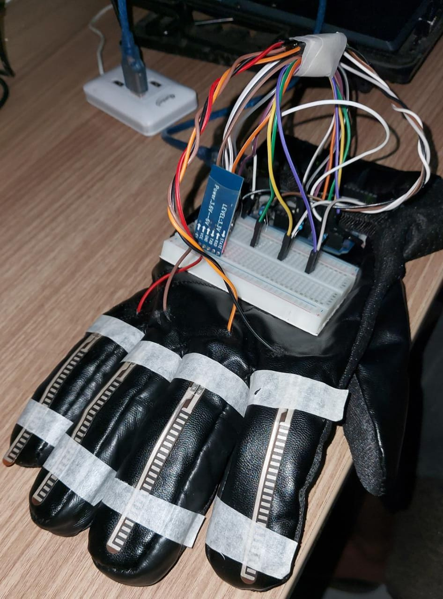

<h1 style="font-size: 28px; text-align: center;">..Gesture-Vocalizer..</h1>

The Gesture Vocalizer is a project that integrates flex sensor technology to enable users to control vocal commands through hand gestures. By using flexible sensors that detect the bending of the hand, this system translates specific gestures into corresponding vocal outputs. It offers a unique and intuitive way for users to interact with devices or applications without the need for traditional input methods like keyboards or touchscreens. With the Gesture Vocalizer, users can perform various gestures, such as bending their fingers or making specific hand movements, to trigger specific vocal commands, providing a more immersive and hands-free user experience.

